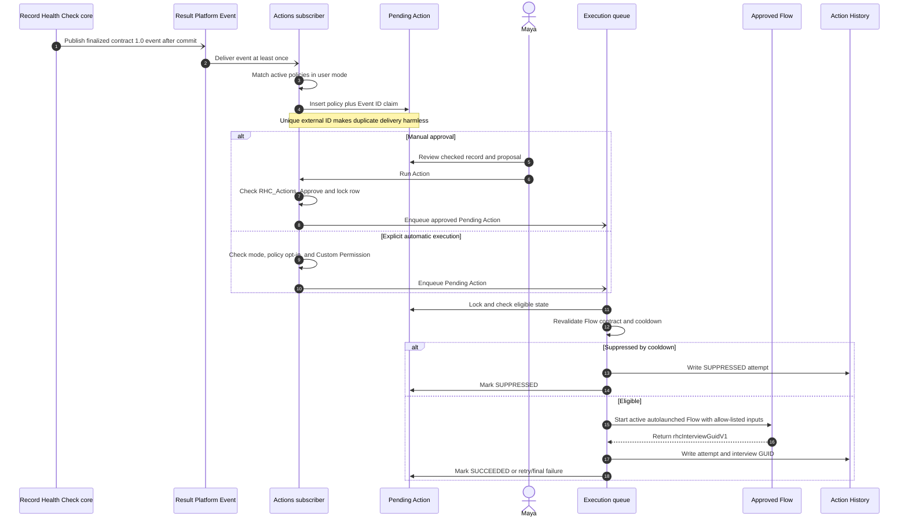

# RHC Actions architecture

## Purpose and boundary

RHC Actions converts selected finalized Record Health Check outcomes into governed, auditable
invocations of approved same-org autolaunched Flows.

The package has one runtime dependency: promoted Record Health Check core
`Record Health Check@2.0.4-2` (`04tak000000cZBFAA2`). It consumes core contract `1.0` directly from
`Record_Health_Check_Result__e` and does not read Run Manager, Alerts, Reports, Integrations, or
another extension.

Core is read-only. RHC Actions owns every policy, queue record, correction attempt, approval fact,
Flow invocation, and audit record. It never updates core metadata or core runtime data.

## System landscape

```mermaid
%%{init: {"flowchart": {"nodeSpacing": 70, "rankSpacing": 65}} }%%
flowchart LR
    subgraph core["Record Health Check core"]
        CHECK["Health Check evaluation"]
        EVENT["Record_Health_Check_Result__e<br/>contract 1.0"]
    end

    subgraph actions["RHC Actions package"]
        TRIGGER["RHCActionResultSubscriber"]
        CAPTURE["RHCActionCaptureService"]
        POLICY[("Corrective Action Policy")]
        PENDING[("Pending Action")]
        REVIEW["RHC Actions Review LWC"]
        EXECUTE["RHCActionExecutionService"]
        HISTORY[("Action History")]
        SETTING[("Action Setting")]
        RETENTION["RHCActionRetentionService"]
    end

    subgraph customer["Customer-owned automation"]
        FLOW["Approved active<br/>autolaunched Flow"]
        RECORD[("Business records")]
    end

    CHECK -->|"PublishAfterCommit; not NONE"| EVENT
    EVENT --> TRIGGER
    TRIGGER --> CAPTURE
    POLICY --> CAPTURE
    CAPTURE -->|"unique policy + Event ID"| PENDING
    PENDING --> REVIEW
    REVIEW -->|"manual approval"| EXECUTE
    PENDING -->|"authorized automatic mode"| EXECUTE
    EXECUTE -->|"contract 1.0 inputs"| FLOW
    FLOW --> RECORD
    EXECUTE --> HISTORY
    REVIEW -->|"save window / confirm purge"| RETENTION
    SETTING --> RETENTION
    RETENTION -->|"old completed rows only"| HISTORY
    RETENTION -->|"old terminal rows only"| PENDING
    RECORD -.->|"can cause later reevaluation"| CHECK

    style core fill:#ecfeff,stroke:#0e7490,stroke-dasharray:5
    style actions fill:#eef2ff,stroke:#4338ca,stroke-dasharray:5
    style customer fill:#ecfdf5,stroke:#047857,stroke-dasharray:5
    style EVENT fill:#99f6e4,stroke:#0f766e,color:#1f2937
    style POLICY fill:#fde68a,stroke:#b45309,color:#1f2937
    style PENDING fill:#fde68a,stroke:#b45309,color:#1f2937
    style HISTORY fill:#fde68a,stroke:#b45309,color:#1f2937
    style FLOW fill:#c7d2fe,stroke:#4338ca,color:#1f2937
```



ASCII fallback:

```text
Core evaluation
      │ PublishAfterCommit Result event (publication is not NONE)
      ▼
Result Platform Event ──> subscriber trigger ──> policy matching
      │
      ▼
unique Pending Action
      │
      ├── manual review ──┐
      └── authorized auto ┤
                         ▼
              lock + revalidate + cooldown
                         │
                         ▼
              approved autolaunched Flow
                         │
               ┌─────────┴─────────┐
               ▼                   ▼
       business mutation      Action History
               │
               └── possible later evaluation/event
```

The Mermaid and ASCII views describe the same boundaries. Dashed feedback represents a later
transaction, not a synchronous call back into core.

## End-to-end sequence



Sequence ASCII fallback:

```text
Core ──publish──> Event ──deliver──> Subscriber
                                      │
                               match + unique claim
                                      ▼
                                Pending Action
                                      │
Maya ──review + approve once──────────>│
                                      │ enqueue
                                      ▼
                                    Queue
                                      │ lock + validate
                                      ▼
                                    Flow
                                      │ interview GUID
                                      ▼
                       Pending terminal state + History
```

## Transaction boundaries

There are at least three transactions:

1. Core evaluates the record and commits its work. The Result event uses `PublishAfterCommit`.
2. Salesforce delivers the Platform Event to `RHCActionResultSubscriber`, which matches policies
   and inserts Pending Actions.
3. A Queueable locks a Pending Action, revalidates safety controls, starts the Flow, and stores its
   audit result.

Manual approval adds a separate user transaction before the Queueable. There is no supported way to
make the original evaluation, event delivery, approval, and correction one atomic transaction.

## Component responsibilities

| Component                     | Responsibility                                                                              | Must not do                                                               |
| ----------------------------- | ------------------------------------------------------------------------------------------- | ------------------------------------------------------------------------- |
| `RHCActionResultSubscriber`   | Receive finalized core Result events and delegate the trigger batch                         | Query extension objects or start Flows directly                           |
| `RHCActionCaptureService`     | Match active policies, create idempotent Pending Actions, enqueue authorized automatic work | Read other extensions, deserialize arbitrary payloads, or mutate core     |
| `RHCActionPolicyService`      | Validate policy basics, active Flow type/version, and contract variables                    | Prove internal Flow behavior is safe                                      |
| `RHCActionFlowGateway`        | Inspect active Flow metadata and start the approved interview                               | Add unapproved variables or expose Flow outputs beyond the interview GUID |
| `RHCActionReviewController`   | List visible manual work, enforce approval permission, lock and transition review state     | Trust client-side approval state                                          |
| `rhcActionReview`             | Present Pending Actions and invoke server-authorized approve/reject operations              | Decide authorization or execute Flow in JavaScript                        |
| `RHCActionExecutionQueueable` | Run approved work asynchronously and schedule bounded delayed retries                       | Retry without the policy limit                                            |
| `RHCActionExecutionService`   | Lock, revalidate, enforce cooldown, start Flow, and write safe audit state                  | Store exception messages, stack traces, payloads, or Flow outputs         |
| `RHCActionRetentionService`   | Save the singleton in user mode; enforce permission, terminal filters, and 1,000-row cleanup cap | Schedule cleanup or expose unrestricted delete CRUD                   |

## Retention transaction boundary

The review controller delegates retention reads, saves, and purges to `RHCActionRetentionService`.
Setting access remains user mode. The service is `without sharing` only for its narrow system-mode
audit deletion boundary and first requires `RHC_Actions_Manage_Retention` plus setting CRUD. It
selects completed History first and terminal Pending Actions only with remaining capacity. Each
request is one transaction and rolls back if a delete fails. No scheduler or background purge is
included.

## Invariants

These rules are architectural, not optional configuration:

1. No Result event means no action. Publication `NONE` is invisible to this package.
2. One policy plus one core Event ID can create only one Pending Action.
3. A Pending Action can move out of `PENDING_REVIEW` only through server-authorized Apex.
4. Manual approval is the default.
5. Automatic execution needs policy mode, explicit policy opt-in, and a dedicated Custom Permission.
6. The active Flow must be `AutoLaunchedFlow` and satisfy contract `1.0` at execution time.
7. Only eight approved scalar Text facts can enter Flow.
8. Every execution attempt gets a unique attempt key and audit record.
9. A positive cooldown is mandatory and bounded retries cannot exceed three.
10. Package code performs no human notification or external callout.

## Loop and duplicate controls

Duplicate delivery and correction loops are different problems:

- **Duplicate delivery:** `Idempotency_Key__c = PolicyId + ':' + EventId`. The field is unique and an
  external ID. Partial insert allows one duplicate to fail without rolling back unrelated events.
- **Duplicate attempt:** `Execution_Key__c = PendingActionId + ':' + AttemptNumber` is unique.
- **Later reevaluation:** a successful attempt for the same Policy ID and Record ID blocks another
  execution during the policy cooldown. The later proposal is audited as suppressed.
- **Transient start failure:** the Queueable waits at least one minute and retries only within the
  policy's zero-to-three retry limit.

## Known limits

- Flow metadata validation proves the active type and declared variables, not the business effects
  of elements, subflows, Apex actions, or downstream automation.
- The event contract has no correction-causation token. Event ID idempotency plus policy-record
  cooldown is the Day-1 loop control.
- Flow and Platform Event execution use Salesforce identities whose sharing, CRUD, field access,
  Flow access, Apex access, and licenses apply.
- A successful Flow can commit broad side effects that this package cannot reverse.
- The review list returns at most 200 oldest Pending Actions visible to the current user.
