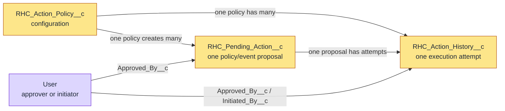

# RHC Actions data model

## Ownership and sharing

RHC Actions owns three private custom objects. Core and other extensions own none of these records.
All three objects use private organization-wide sharing. Access comes from the packaged Permission
Sets plus the org's role, sharing, and administrative model.



ASCII fallback:

```text
Corrective Action Policy 1 ───────< many Pending Actions
           │                              │
           │                              └──────< many Action History attempts
           └────────────────────────────────────< many Action History attempts

User ──> Pending Action.Approved By
User ──> Action History.Approved By / Initiated By
```

Relationships are lookups, not master-detail. Package uninstall removes package-owned objects and
their data; it does not remove core.

## Corrective Action Policy

API name: `RHC_Action_Policy__c`

One record defines one exact Check match and one approved Flow contract. The name is an auto-number
with display format `RHC-POL-{000000}`.

| Field                             | Type/default    | Meaning and validation                                             |
| --------------------------------- | --------------- | ------------------------------------------------------------------ |
| `Active__c`                       | Checkbox; false | Only active policies are considered when an event arrives          |
| `Check_Set_Qualified_API_Name__c` | Text; optional  | Exact Check Set identity; blank matches the Check in any Check Set |
| `Check_Qualified_API_Name__c`     | Text            | Required exact Check identity                                      |
| `Matching_Statuses__c`            | Text            | Required semicolon-separated exact statuses, such as `FAIL;ERROR`  |
| `Matching_Severity__c`            | Text; optional  | Blank matches any severity; otherwise exact match                  |
| `Flow_API_Name__c`                | Text            | Required API name of the active no-trigger autolaunched Flow       |
| `Mode__c`                         | Picklist        | `MANUAL_APPROVAL` or `AUTOMATIC`; manual is the default            |
| `Auto_Execution_Enabled__c`       | Checkbox; false | Explicit policy opt-in required with automatic mode                |
| `Cooldown_Minutes__c`             | Number; 60      | Must be at least 1                                                 |
| `Retry_Limit__c`                  | Number; 1       | Must be an integer from 0 through 3                                |
| `Input_Contract_Version__c`       | Text            | Must equal `1.0`                                                   |
| `Map_Record_Id__c`                | Checkbox; false | Supplies `rhcRecordIdV1`                                           |
| `Map_Run_Id__c`                   | Checkbox; false | Supplies `rhcRunIdV1`                                              |
| `Map_Check_Set__c`                | Checkbox; false | Supplies `rhcCheckSetQualifiedApiNameV1`                           |
| `Map_Check__c`                    | Checkbox; false | Supplies `rhcCheckQualifiedApiNameV1`                              |
| `Map_Status__c`                   | Checkbox; false | Supplies `rhcStatusV1`                                             |
| `Map_Severity__c`                 | Checkbox; false | Supplies `rhcSeverityV1`                                           |
| `Map_Reason_Code__c`              | Checkbox; false | Supplies `rhcReasonCodeV1`                                         |
| `Map_Event_Id__c`                 | Checkbox; false | Supplies `rhcEventIdV1`                                            |

Policy records can be edited, but every execution revalidates the current policy and active Flow.
Changing a policy does not rewrite historical Pending Action event facts.

## Pending Action

API name: `RHC_Pending_Action__c`

One record represents one policy matched to one finalized core Event ID. The name is an auto-number.

| Field                             | Type                    | Ownership and meaning                                      |
| --------------------------------- | ----------------------- | ---------------------------------------------------------- |
| `Policy__c`                       | Lookup to Policy        | Governing policy                                           |
| `Idempotency_Key__c`              | Unique external-ID Text | `PolicyId:EventId`; duplicate-delivery claim               |
| `Event_Id__c`                     | Text                    | Stable core event identity                                 |
| `Contract_Version__c`             | Text                    | Core Result contract; only `1.0` is accepted               |
| `Record_Id__c`                    | Text                    | Checked business record ID                                 |
| `Run_Id__c`                       | Text                    | Originating core run ID                                    |
| `Check_Set_Qualified_API_Name__c` | Text                    | Copied approved core fact                                  |
| `Check_Qualified_API_Name__c`     | Text                    | Copied approved core fact                                  |
| `Status__c`                       | Text                    | Copied finalized result status                             |
| `Severity__c`                     | Text                    | Copied finalized severity                                  |
| `Reason_Code__c`                  | Text                    | Copied bounded reason code                                 |
| `Queue_Status__c`                 | Picklist                | Current lifecycle state                                    |
| `Attempt_Count__c`                | Number                  | Number of Flow start attempts; default 0                   |
| `Available_At__c`                 | Date/Time               | Earliest time a retry may run                              |
| `Loop_Guard_Key__c`               | Text                    | `PolicyId:RecordId` correlation key                        |
| `Approved_By__c`                  | Lookup to User          | Manual approver or rejector; blank for automatic execution |
| `Approved_At__c`                  | Date/Time               | Manual decision time                                       |
| `Flow_Interview_Id__c`            | Text                    | GUID returned by contract output                           |
| `Completed_At__c`                 | Date/Time               | Terminal completion time                                   |
| `Last_Error_Code__c`              | Text                    | Bounded package-authored operational code                  |
| `Last_Error_Summary__c`           | Text Area               | Bounded safe explanation; never exception text             |

### Pending Action state machine

| State            | Entered when                                                                                                  | Valid next behavior                                |
| ---------------- | ------------------------------------------------------------------------------------------------------------- | -------------------------------------------------- |
| `PENDING_REVIEW` | A manual policy matches, or automatic authorization is absent                                                 | Approver can queue or reject                       |
| `QUEUED`         | Manual approval succeeds or an automatic policy is fully authorized                                           | Queueable attempts execution                       |
| `RUNNING`        | Reserved lifecycle value; current execution sets it only inside the transaction and replaces it before commit | Normally not externally observable in Day-1 source |
| `SUCCEEDED`      | Flow completed and returned the interview GUID                                                                | Terminal                                           |
| `RETRY_WAIT`     | A retryable start failed and attempts remain                                                                  | Delayed Queueable retries after `Available_At__c`  |
| `FAILED`         | Contract invalid or retry limit exhausted                                                                     | Terminal                                           |
| `SUPPRESSED`     | Same policy and record has recent success inside cooldown                                                     | Terminal                                           |
| `REJECTED`       | Approver rejects a manual proposal                                                                            | Terminal; no Flow-attempt history                  |

Client code cannot directly choose a state transition. Apex rechecks permission and locks the row.

## Action History

API name: `RHC_Action_History__c`

One record represents one execution or suppression attempt. A manual rejection is stored on Pending
Action only because no Flow attempt occurred.

| Field                  | Type                     | Meaning                                                          |
| ---------------------- | ------------------------ | ---------------------------------------------------------------- |
| `Execution_Key__c`     | Unique external-ID Text  | `PendingActionId:AttemptNumber`                                  |
| `Pending_Action__c`    | Lookup to Pending Action | Proposal being attempted                                         |
| `Policy__c`            | Lookup to Policy         | Governing policy at execution                                    |
| `Event_Id__c`          | Text                     | Core event correlation                                           |
| `Record_Id__c`         | Text                     | Checked record correlation                                       |
| `Run_Id__c`            | Text                     | Core run correlation                                             |
| `Approved_By__c`       | Lookup to User           | Manual approver when applicable                                  |
| `Initiated_By__c`      | Lookup to User           | Identity running the attempt                                     |
| `Attempt_Number__c`    | Number                   | One-based attempt number                                         |
| `Started_At__c`        | Date/Time                | Attempt start                                                    |
| `Completed_At__c`      | Date/Time                | Attempt end                                                      |
| `Flow_Interview_Id__c` | Text                     | Contract output for successful execution                         |
| `Outcome__c`           | Picklist                 | `SUCCEEDED`, `FAILED_RETRYABLE`, `FAILED_FINAL`, or `SUPPRESSED` |
| `Error_Code__c`        | Text                     | Bounded non-sensitive code                                       |
| `Error_Summary__c`     | Text Area                | Bounded package-authored summary                                 |

## Stored and prohibited data

Stored facts are limited to identifiers, exact configuration identities, status, severity, reason
code, times, user lookups, safe outcome codes, and bounded package-authored summaries.

Never add fields or logs that store:

- the raw Platform Event payload;
- unrestricted checked values or expected values;
- arbitrary JSON;
- exception messages or stack traces;
- `$Flow.FaultMessage`;
- credentials, tokens, or Named Credential material; or
- arbitrary Flow input or output maps.
