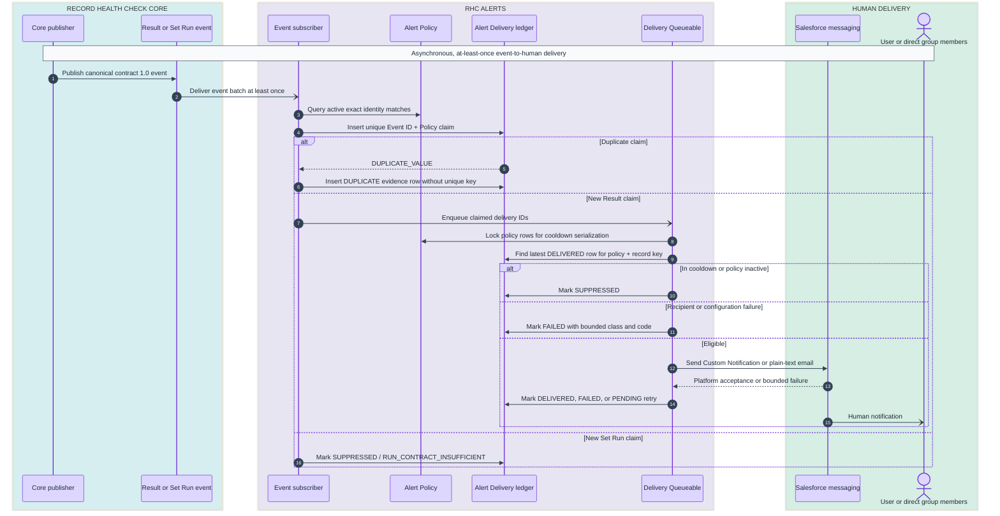

# RHC Alerts architecture

## Purpose and boundary

RHC Alerts turns selected canonical Record Health Check outcomes into human notifications. It owns
policy configuration, an operational delivery ledger, recipient resolution, cooldown and duplicate
control, Custom Notification and email delivery, setup diagnostics, bounded manual ledger cleanup,
and its Lightning UI.

It does not schedule or execute health checks, retain general result history, update checked
business records, call external endpoints, or read another extension's objects or Apex. Its only
package dependency is promoted Record Health Check core `2.0.4-2`.

## Runtime sequence

### Mermaid



### ASCII fallback

```text
┌───────────────────┐      ┌──────────────────┐
│ RHC core publisher│      │ Core Platform    │
│ contract 1.0      │─────>│ Event            │
└───────────────────┘      └────────┬─────────┘
                                    │ at least once
                                    ▼
                           ┌──────────────────┐
                           │ Alerts subscriber│
                           │ exact matching   │
                           └───────┬──────────┘
                                   │ unique Event + Policy claim
                                   ▼
                           ┌──────────────────┐
                           │ Delivery ledger  │
                           └───────┬──────────┘
                                   │ new Result claim only
                                   ▼
                           ┌──────────────────┐
                           │ Queueable        │
                           │ lock + cooldown  │
                           └───────┬──────────┘
                                   │
                     ┌─────────────┴─────────────┐
                     ▼                           ▼
             ┌───────────────┐          ┌────────────────┐
             │ SUPPRESSED /  │          │ Custom Notice  │
             │ FAILED / DUP  │          │ or Email       │
             └───────────────┘          └───────┬────────┘
                                                ▼
                                      ┌──────────────────┐
                                      │ Human recipient  │
                                      └──────────────────┘
```

The important separation is transactional: the health-check transaction publishes an event; the
Platform Event subscriber claims ledger rows; a Queueable performs human delivery. A successful
health-check screen does not imply that notification delivery has completed.

## Component ownership

| Component                      | Responsibility                                                                                                                  |
| ------------------------------ | ------------------------------------------------------------------------------------------------------------------------------- |
| `RHCAlertsResultSubscriber`    | Receives canonical Result event batches directly from core                                                                      |
| `RHCAlertsSetRunSubscriber`    | Receives canonical Set Run event batches directly from core                                                                     |
| `RHCAlertsEventService`        | Exact policy matching, contract-version filtering, idempotent claim creation, duplicate evidence, Queueable dispatch            |
| `RHCAlertsDeliveryQueueable`   | Slices work into at most 10 ledger rows, chains remaining or retry work, and uses a Finalizer to disposition unhandled failures |
| `RHCAlertsDeliveryService`     | Policy locking, cooldown, recipient resolution, platform delivery, retry/failure state updates                                  |
| `RHCAlertsRecipientResolver`   | Resolves one active User or direct active User members of a Regular public Group                                                |
| `RHCAlertsCoreMetadataGateway` | Reads public core Check and Check Set Custom Metadata for pickers and publication diagnostics                                   |
| `RHCAlertsPolicyValidator`     | Pure canonical policy-value validation shared by the administrator save path and direct tests                                   |
| `RHCAlertsAdminController`     | Thin user-facing endpoints that delegate policy and retention work while retaining setup-assistant and limit responses          |
| `RHCAlertsPolicyAdminService`  | User-mode policy listing/save, bounded recipient-directory queries, and current-user test sends                                 |
| `RHCAlertsRetentionService`    | User-mode singleton retention settings and bounded oldest-first terminal-delivery deletion                                      |
| `RHCAlertsViewerController`    | Sole Viewer Apex surface; returns the bounded 500-row delivery-history projection in user mode                                  |
| `rhcAlertsAdmin`               | Guided policy creation, publication coverage, and acknowledged manual retention UI                                              |
| `rhcAlertsDeliveryHistory`     | Last 500 operational delivery rows visible to the current user                                                                  |

## Event contract decisions

Result contract `1.0` is the authoritative delivery input because it carries exact Check and Check
Set Qualified API Names, canonical status, severity when defined, record correlation, Event ID,
Run ID, timestamp, source, and framework version.

Set Run contract `1.0` has Phase and counts but no canonical aggregate status or severity. Alerts
subscribes to it as required, but never invents those values. A matching Set Run policy evaluation is
stored as `SUPPRESSED / RUN_CONTRACT_INSUFFICIENT`; Check Set human notifications are driven by the
matching Result events from Checks in that set. See [the gap analysis](../GAP_ANALYSIS.md).

## Exact matching and severity

- Qualified API Names are opaque, case-sensitive strings. Namespace prefixes are neither removed
  nor added.
- Check policies match `CheckQualifiedApiName__c`.
- Check Set policies match `CheckSetQualifiedApiName__c` on Result events.
- Status membership uses the canonical five values without translation.
- Severity ordering is `INFO < WARNING < CRITICAL` when the event supplies severity.
- An event without severity passes the severity test; status remains the governing criterion for
  outcomes, such as PASS or SKIPPED, that can legitimately lack severity.

## Idempotency, ordering, and cooldown

`DeliveryKey__c` is a unique SHA-256 digest of `EventId__c + '|' + PolicyId`. An at-least-once
redelivery therefore cannot create a second successful claim. The subscriber creates a separate
`DUPLICATE` evidence row with no unique key so administrators can distinguish redelivery from
silence.

`CooldownKey__c` is a SHA-256 digest of `PolicyId + '|' + RecordId`. A missing Record ID uses the
literal `NO_RECORD`, making cooldown policy-wide for events that do not identify a checked record.
Policy rows are locked before the latest successful delivery is evaluated. The comparison uses the
canonical event occurrence time, not Queueable start time.

## Bulk and limit behavior

- Platform Event triggers pass the full trigger batch to the service.
- Policies are queried once for the set of distinct event identities, not once per event.
- Claims use partial-success bulk DML so one duplicate does not reject unrelated claims.
- Candidate fan-out is capped at 2,000 claims per trigger transaction. If another matching policy is
  encountered, processing stops and one durable `FAILED / LIMIT / EVENT_POLICY_FANOUT_LIMIT` row
  records that the batch was truncated; operators must reduce policy fan-out or event-batch size.
- Every partial-success claim/evidence/update result is inspected. Non-duplicate claim failures are
  converted to sanitized `CLAIM_INSERT_FAILED` evidence when the fallback row can be persisted.
- A Queueable handles at most 10 delivery rows, bounding email send invocations and recipient work.
- Additional rows chain into another Queueable.
- Queue dispatch failures are terminally recorded, and the Queueable Finalizer marks any original
  claims still `PENDING` after an unhandled exception as `QUEUEABLE_UNHANDLED_FAILURE`.
- The resolver queries at most 5,001 group members and 5,000 active Users.
- Package caps are 500 Custom Notification recipients and 10 email recipients per attempt.
- Email messages for one policy audience are submitted all-or-none so ledger state cannot report a
  wholly failed attempt after Salesforce accepted only a subset of recipients.

Salesforce Platform Event, Queueable, email, notification, daily messaging, and storage allocations
remain external limits. See [operations](OPERATIONS.md).

## Package independence

The extension does not import RHC Run Manager, Reports, Actions, Integrations, or Builder metadata.
It references only the canonical core Platform Events and the two public core Custom Metadata types
needed by the setup assistant. Removing Alerts does not alter core execution or another extension.
