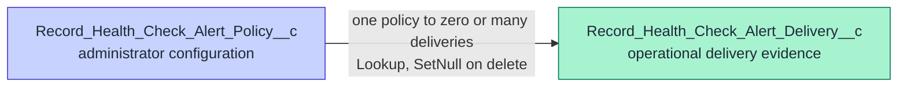

# RHC Alerts data model

RHC Alerts owns two private custom objects. Alert Policy is administrator configuration. Alert
Delivery is a bounded operational ledger for notification attempts; it is not a general health-check
result store.

## Relationship



```text
┌────────────────────────────────────────┐
│ Record_Health_Check_Alert_Policy__c    │
│ one administrator-approved policy      │
└────────────────────┬───────────────────┘
                     │ 1 : 0..n Lookup (SetNull)
                     ▼
┌────────────────────────────────────────┐
│ Record_Health_Check_Alert_Delivery__c  │
│ one claim or duplicate evidence row    │
└────────────────────────────────────────┘
```

## Alert Policy fields

| Field                    | Type                | Meaning and validation                                                                         |
| ------------------------ | ------------------- | ---------------------------------------------------------------------------------------------- |
| `Name`                   | Auto Number         | Operational identifier `RHC-AP-{000000}`                                                       |
| `DisplayName__c`         | Text(80)            | Administrator-facing policy name                                                               |
| `Active__c`              | Checkbox            | Only active policies are queried by event subscribers                                          |
| `SelectionType__c`       | Restricted Picklist | `CHECK_SET` or `CHECK`                                                                         |
| `QualifiedApiName__c`    | Text(120)           | Exact opaque core identity, including namespace                                                |
| `MatchingStatuses__c`    | Text(255)           | Semicolon-delimited canonical values: `PASS`, `FAIL`, `SKIPPED`, `UNABLE_TO_EVALUATE`, `ERROR` |
| `MinimumSeverity__c`     | Restricted Picklist | `INFO`, `WARNING`, or `CRITICAL`                                                               |
| `RecipientType__c`       | Restricted Picklist | `USER` or `PUBLIC_GROUP`                                                                       |
| `RecipientId__c`         | Text(18)            | Selected User or Regular Group ID; resolved again at delivery time                             |
| `RecipientLabel__c`      | Text(255)           | Non-authoritative display label captured by the UI                                             |
| `NotificationChannel__c` | Restricted Picklist | `CUSTOM_NOTIFICATION` or `EMAIL`                                                               |
| `CooldownMinutes__c`     | Number(7,0)         | Zero or greater; quiet period per policy and checked record                                    |

Policy records use private sharing. `RHC Alerts Admin` receives create, read, edit, delete, View All,
and Modify All on this package-owned configuration object. `RHC Alerts Viewer Runtime` receives
read and View All only so its user-mode history query can resolve `DisplayName__c`; every other
policy field and the generic policy tab are omitted from that permission set.

## Alert Delivery fields

| Field                         | Type                        | Meaning and retention rule                                                                                                                                                                                                    |
| ----------------------------- | --------------------------- | ----------------------------------------------------------------------------------------------------------------------------------------------------------------------------------------------------------------------------- |
| `Name`                        | Auto Number                 | Operational identifier `RHC-AD-{000000}`                                                                                                                                                                                      |
| `Policy__c`                   | Lookup                      | Policy evaluated; deletion behavior is SetNull                                                                                                                                                                                |
| `DeliveryKey__c`              | Unique External ID Text(64) | SHA-256 Event ID + Policy claim; null only on duplicate evidence rows                                                                                                                                                         |
| `EventId__c`                  | External ID Text(80)        | Canonical core Event ID                                                                                                                                                                                                       |
| `EventType__c`                | Restricted Picklist         | `RESULT` or `SET_RUN`                                                                                                                                                                                                         |
| `RunId__c`                    | Text(120)                   | Canonical core run correlation                                                                                                                                                                                                |
| `CheckSetQualifiedApiName__c` | Text(120)                   | Exact core Check Set identity                                                                                                                                                                                                 |
| `CheckQualifiedApiName__c`    | Text(120)                   | Exact core Check identity when present                                                                                                                                                                                        |
| `RecordId__c`                 | Text(18)                    | Checked record correlation when the event supplies it; never updated                                                                                                                                                          |
| `Status__c`                   | Text(30)                    | Canonical Result status, or Set Run Phase on suppressed contract evidence                                                                                                                                                     |
| `Severity__c`                 | Text(20)                    | Canonical severity when present                                                                                                                                                                                               |
| `Outcome__c`                  | Restricted Picklist         | `PENDING`, `DELIVERED`, `SUPPRESSED`, `FAILED`, or `DUPLICATE`                                                                                                                                                                |
| `SuppressionReason__c`        | Restricted Picklist         | `COOLDOWN`, `RUN_CONTRACT_INSUFFICIENT`, `NO_RECIPIENTS`, or `POLICY_INACTIVE`; blank unless Outcome is `SUPPRESSED`; `NO_RECIPIENTS` is reserved in 0.1.0 while recipient failures currently use configuration failure codes |
| `FailureClass__c`             | Restricted Picklist         | `TRANSIENT`, `PERMANENT`, `LIMIT`, or `CONFIGURATION`; blank unless an attempt failed or remains pending for retry                                                                                                            |
| `ErrorCode__c`                | Text(80)                    | Package-owned bounded code; never raw exception text                                                                                                                                                                          |
| `AttemptCount__c`             | Number(2,0)                 | Delivery attempts made, maximum three for package retries                                                                                                                                                                     |
| `RecipientCount__c`           | Number(5,0)                 | Direct active human recipients resolved for the attempt                                                                                                                                                                       |
| `OccurredAt__c`               | DateTime                    | Canonical event time used in cooldown comparison                                                                                                                                                                              |
| `AttemptedAt__c`              | DateTime                    | Most recent package delivery attempt                                                                                                                                                                                          |
| `DeliveredAt__c`              | DateTime                    | Salesforce platform acceptance time for a successful send                                                                                                                                                                     |
| `NextRetryAt__c`              | DateTime                    | Earliest scheduled package retry for a retryable failure                                                                                                                                                                      |
| `CooldownKey__c`              | External ID Text(64)        | SHA-256 Policy + checked record key                                                                                                                                                                                           |

Delivery records use private sharing. Both packaged permission sets are read-only on this object;
Admin and Viewer receive View All so the Lightning history can show platform-owned rows. Runtime
subscriber code updates only package-owned ledger rows in platform context.

## State model

| State        | Terminal? | Meaning                                                         |
| ------------ | --------- | --------------------------------------------------------------- |
| `PENDING`    | No        | Newly claimed, queued, or awaiting a bounded transient retry    |
| `DELIVERED`  | Yes       | Salesforce accepted the Custom Notification or email request    |
| `SUPPRESSED` | Yes       | Policy deliberately produced no human message                   |
| `FAILED`     | Yes       | Configuration, limit, permanent, or exhausted transient failure |
| `DUPLICATE`  | Yes       | A unique Event ID + Policy claim already exists                 |

No state means “the recipient read the message.” `DELIVERED` records platform acceptance, not email
inbox placement, notification viewing, or action by the recipient.

## Data minimization and non-goals

The ledger retains only identity, canonical classification, recipient count, timestamps, and bounded
operational state. It has no raw event payload, found value, expected value, unrestricted reason,
email body, exception message, stack trace, or webhook response. Do not use it for trend analysis;
that belongs in the separate Reports extension.
