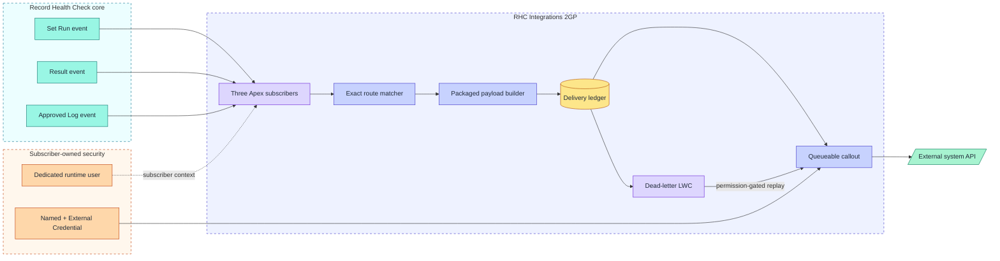
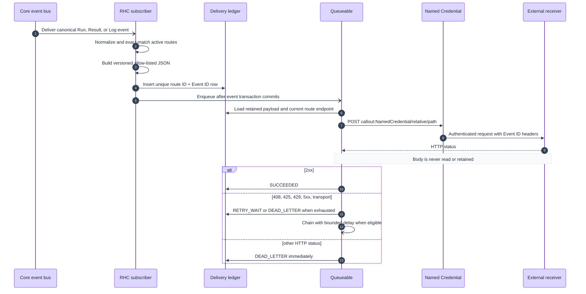

# Architecture

## Purpose and hard boundary

RHC Integrations is an independently installable 2GP extension that converts approved canonical
Record Health Check Platform Events into bounded outbound HTTP requests. Its only package dependency
is Record Health Check core 2.0.4.2 (`04tak000000cZBFAA2`). It does not query another extension,
invoke another extension's Apex, update checked records, notify humans, or retain a reporting fact
table.

## System landscape



ASCII fallback:

```text
Core Run / Result / Log events
              │
              ▼
     Apex event subscribers  <·· dedicated runtime user
              │
              ▼
      exact route matching
              │
              ▼
   packaged payload allow-list
              │
              ▼
       delivery ledger ─────────> dead-letter UI ── replay ─┐
              │                                             │
              ▼                                             │
      Queueable callout <────────────────────────────────────┘
              │
              ▼
 Named/External Credential ─────> external receiver
```

## Component responsibilities

| Component | Responsibility | Must not do |
| --- | --- | --- |
| `RHCIntegration*Subscriber` triggers | Subscribe directly to canonical core events and pass the trigger batch to the handler | Query business records or call an endpoint |
| `RHCIntegrationEventHandler` | Normalize event shapes, derive safe Run status, persist at most 1,000 idempotent ledger rows per subscriber transaction, and enqueue work | Read another extension, reconstruct unpublished data, or silently discard non-duplicate insert failures |
| `RHCIntegrationDeliveryFactory` | Exact-match canonical event DTOs to routes and construct bounded, versioned delivery rows | Query, perform DML, or enqueue work |
| `RHCIntegrationRouteSelector` | Load at most 2,000 active routes needed at runtime | Accept executable behavior from records |
| `RHCIntegrationPayloadBuilder` | Build one of four compiled profile contracts at version 1.0 | Interpret customer templates or add absent fields |
| `RHCIntegrationDeliveryQueueable` | Lock a slice of up to ten retained deliveries, perform their callouts, persist the slice with one update, chain bounded retry/work, and finalize unhandled failures | Read/store response bodies or raw exceptions |
| `RHCIntegrationDeliveryPolicy` | Validate route safety, POST the retained payload, classify only status code, and apply explicit system-mode ledger transitions | Accept arbitrary URLs, read response bodies, or retain raw exceptions |
| `RHCIntegrationDeadLetterController` | Return a payload-free user-mode projection, permission-gated and field-sanitized replay, and retention operations delegated to the retention service | Expose payload, bypass record access, or partially reset replay state after field stripping |
| `RHCIntegrationRetentionService` | Field-sanitize and store the package retention window in user mode, then execute explicitly requested, user-mode, terminal-only cleanup in batches of at most 1,000 rows | Schedule deletion or delete active delivery states |
| `rhcIntegrationDeadLetters` LWC | Display the sanitized dead-letter projection and authorized Replay/retention actions | Query objects directly, expose secrets, or imply that saving settings schedules cleanup |

## Event-to-callout sequence



Sequence ASCII fallback:

```text
Core event  Subscriber  Ledger       Queueable     Credential     Receiver
    │           │          │              │              │             │
    │ event     │          │              │              │             │
    ├──────────>│ match + build           │              │             │
    │           ├─────────>│ PENDING       │              │             │
    │           │          │ enqueue ─────>│              │             │
    │           │          │              ├─────────────>│ auth + POST │
    │           │          │              │              ├────────────>│
    │           │          │              │<──────────── status only ──┤
    │           │          │<─────────────┤ success / retry / dead     │
```

## Transaction and consistency model

The Platform Event trigger creates ledger rows and enqueues Queueable work in the subscriber
transaction. Queueable execution occurs after commit and performs the callout. Salesforce and the
external receiver do not share a transaction, so exactly-once delivery cannot be guaranteed.

The package provides two duplicate controls:

1. `RouteEventKey__c` is unique for `routeId:eventId`, preventing a second ledger row for the same
   route and Event ID.
2. `Idempotency-Key` and `X-RHC-Event-ID` carry the canonical Event ID to the receiver.

The receiver is responsible for making that Event ID idempotent even across timeouts and replay.

The subscriber coordinator processes delivered events in checkpointed chunks of 50. After each
successful chunk it advances the Platform Event resume checkpoint, so a later failure does not
reprocess earlier committed chunks. Each chunk may create at most 1,000 matching delivery rows; the
handler rejects the whole chunk before DML when event-to-route fan-out would exceed that boundary
and never creates a partial subset. This keeps a maximum 2,000-event subscriber batch within the
50-Queueable transaction limit while leaving bounded DML/SOQL headroom.

Duplicate ledger inserts are successful idempotent redelivery. `UNABLE_TO_LOCK_ROW` and
`UNKNOWN_EXCEPTION` are classified as transient: the first chunk requests at most three explicit
Platform Event retries, while a later chunk resumes after the last committed checkpoint. Permanent
non-duplicate DML failures raise a bounded ingestion exception without entering a futile retry loop.

Each delivery worker locks its ledger row before evaluating state. An unhandled worker exception is
finalized into `DEAD_LETTER` with `QUEUEABLE_UNHANDLED`, and independent remaining IDs continue in a
new worker. Receiver-side Event ID idempotency remains mandatory because the external call and the
Salesforce ledger update cannot be atomic.

## Architectural invariants

- Publication `NONE` means there is no event and therefore no delivery.
- Only event contract `1.0` is accepted for delivery; unsupported contracts dead-letter.
- Route matching is exact and case-sensitive.
- Missing severity fails closed when a route sets a minimum severity.
- Credentials and secrets exist only in subscriber-owned Salesforce credential facilities.
- Response bodies, exception messages, and stack traces never enter the ledger.
- Payload profiles are code-owned, named, versioned contracts with no customer execution point.
- Successful HTTP status proves only receipt response, not downstream completion.

Diagram quality review: 76/80—source-grounded actors and branches, accessible labels/colors,
Mermaid plus plain-text fallbacks; intentionally omits field-level detail covered by the linked
configuration and payload references.
