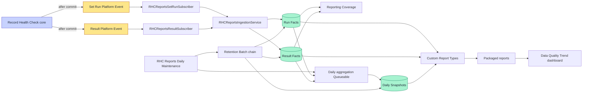

# Architecture and data model

**Applies to:** RHC Reports 0.1.0  
**Core dependency:** Record Health Check 2.0.4.2, contract 1.0

## Responsibility boundary

Record Health Check core evaluates records and publishes canonical lifecycle events after commit.
Core remains stateless. RHC Reports subscribes to those events and owns every durable analytical
write. It never reads an RHC Run Manager object.

RHC Reports does not schedule evaluations, notify users, execute corrective Flows, or call an
external system. Its scheduled job only aggregates and removes its own analytical records.

## Component flow



ASCII fallback:

```text
Core evaluation
   ├── Set Run event ──> subscriber ──> Run Fact ──────┐
   └── Result event ───> subscriber ──> Result Fact ───┼──> Coverage
                                                      │
Daily maintenance ──> aggregation Queueable ──────────┴──> Daily Snapshot
                 └──> Result → Run → Snapshot retention deletion

Run Fact + Result Fact + Daily Snapshot → report types → reports → dashboard
```

## Runtime components

| Component | Responsibility |
| --- | --- |
| `RHCReportsSetRunSubscriber` | Receives bulk `Record_Health_Check_Set_Run__e` deliveries after insert. |
| `RHCReportsResultSubscriber` | Receives bulk `Record_Health_Check_Result__e` deliveries after insert. |
| `RHCReportsIngestionService` | Validates contract 1.0, removes duplicate Event IDs in the delivery, and upserts facts. |
| `RHCReportsCoverageController` | Combines active core Custom Metadata with observed fact counts and classifies coverage. |
| `RHCReportsSetupController` | Permission-gates one typed settings request, validates retention/time zone, and registers the scheduled job. |
| `RHCReportsMaintenanceScheduled` | At 2:15 AM, launches prior-local-day aggregation and enabled retention cleanup. |
| `RHCReportsDailyAggregationQueueable` | Runs one local-date aggregation. Its Finalizer records a durable outcome, advances the completed-date watermark monotonically, continues bounded catch-up, and starts retention only after catch-up succeeds. |
| `RHCReportsAggregationService` | Applies RUN- and RESULT-grain aggregation rules and creates deterministic snapshot rows. |
| `RHCReportsAggregationRepository` | Owns bounded system-mode fact reads and atomic replacement of one date/time-zone snapshot partition. |
| `RHCReportsRetentionBatch` | Deletes expired Result Facts, then Run Facts, then snapshots in scopes of 200. |

## Object model

The fact objects deliberately store source record IDs as Text rather than Salesforce relationships.
This prevents source deletion from cascading into analytical history and avoids requiring access to
the source object's schema. A deleted source record can therefore leave only its former Record ID.

### Run Fact: `Record_Health_Check_Report_Run__c`

One row represents one accepted canonical Set Run event. `EventId__c` is the unique external ID.

| Field | Type | Required | Meaning |
| --- | --- | --- | --- |
| `EventId__c` | Text(80), unique external ID | Yes | Canonical deduplication identity. |
| `RunId__c` | Text(120) | Yes | Canonical core Run identity; multiple event rows can share a Run ID. |
| `CheckSetQualifiedApiName__c` | Text(80) | Yes | Exact namespaced or local Check Set identity. |
| `RecordId__c` | Text(18) | No | Evaluated source record ID at event time. |
| `OccurredAt__c` | Date/Time | Yes | Canonical event occurrence time. |
| `Source__c` | Text(30) | Yes | Canonical execution source. |
| `ContractVersion__c` | Text(10) | Yes | Accepted public event-contract version. |
| `FrameworkVersion__c` | Text(20) | Yes | Core framework version that published the event. |
| `Phase__c` | Text(30) | Yes | Canonical Set Run phase. |
| `SubmittedRecordCount__c` | Number(7,0) | No | Records submitted to the run. |
| `ProcessedRecordCount__c` | Number(7,0) | No | Records processed when the event was published. |
| `EligibleCheckCount__c` | Number(7,0) | No | Checks eligible for evaluation. |
| `EvaluatedCheckCount__c` | Number(7,0) | No | Checks that produced an evaluated outcome. |
| `PassedCount__c` | Number(7,0) | No | Canonical `PASS` count. |
| `FailedCount__c` | Number(7,0) | No | Canonical `FAIL` count. |
| `SkippedCount__c` | Number(7,0) | No | Canonical `SKIPPED` count. |
| `UnableCount__c` | Number(7,0) | No | Canonical `UNABLE_TO_EVALUATE` count. |
| `SystemErrorCount__c` | Number(7,0) | No | Canonical `ERROR` count. |

### Result Fact: `Record_Health_Check_Report_Result__c`

One row represents one accepted canonical Check Result event. No restricted-detail field exists.

| Field | Type | Required | Meaning |
| --- | --- | --- | --- |
| `EventId__c` | Text(80), unique external ID | Yes | Canonical deduplication identity. |
| `RunId__c` | Text(120) | Yes | Run identity shared with related Set Run events. |
| `CheckSetQualifiedApiName__c` | Text(80) | Yes | Exact Check Set identity. |
| `CheckQualifiedApiName__c` | Text(80) | Yes | Exact Check identity. |
| `RecordId__c` | Text(18) | No | Evaluated source record ID at event time. |
| `Status__c` | Text(30) | Yes | `PASS`, `FAIL`, `SKIPPED`, `UNABLE_TO_EVALUATE`, or `ERROR`. |
| `Severity__c` | Text(20) | No | `CRITICAL`, `WARNING`, or `INFO` when supplied by core. |
| `ReasonCode__c` | Text(80) | No | Canonical machine-readable reason code. |
| `OccurredAt__c` | Date/Time | Yes | Canonical occurrence time. |
| `Source__c` | Text(30) | Yes | Canonical execution source. |
| `ContractVersion__c` | Text(10) | Yes | Accepted contract version. |
| `FrameworkVersion__c` | Text(20) | Yes | Publishing core framework version. |

### Daily Snapshot: `Record_Health_Check_Daily_Snapshot__c`

One row is one deterministic date/time-zone/grain/dimension group. Repeating aggregation with the
same input upserts the same SHA-256 `SnapshotKey__c`.

| Field group | Fields | Meaning |
| --- | --- | --- |
| Identity | `SnapshotKey__c`, `SnapshotDate__c`, `AggregationTimeZone__c` | Retry-safe key and explicit local reporting day. |
| Grain | `Grain__c` | `RUN` for Set Run summaries or `RESULT` for Check details. |
| Dimensions | `CheckSetQualifiedApiName__c`, `CheckQualifiedApiName__c`, `Status__c`, `Severity__c`, `Source__c` | Exact grouping dimensions; Check/status/severity are blank at RUN grain. |
| Volumes | `RunCount__c`, `ResultCount__c`, `RecordCount__c` | Events and distinct source Record IDs in the group. |
| Status counts | `PassedCount__c`, `FailedCount__c`, `SkippedCount__c`, `UnableCount__c`, `SystemErrorCount__c` | Canonical outcome counts. |
| Change counts | `RecurringFailureCount__c`, `RecoveryCount__c` | Repeated actionable outcomes and actionable-to-PASS transitions. |
| Formulas | `FailureRate__c`, `RecoveryRate__c` | Derived rates described below. |

`FailureRate__c` is `(FAIL + UNABLE_TO_EVALUATE + ERROR) / all five status counts`, or zero when
the denominator is zero. `RecoveryRate__c` is `Recovery / (Recovery + Recurring Failure)`, or zero
when that denominator is zero.

Recurring and recovery comparisons use the prior observed Result Fact for the same Record ID and
Check qualified API name. Under `ACTIONABLE`, PASS is not published, so recovery cannot be measured
completely. Full recovery analysis requires `ALL`.

### Org setting: `Record_Health_Check_Report_Setting__c`

This hierarchy Custom Setting stores one organization-level row.

| Field | Default used by Apex | Validation or behavior |
| --- | --- | --- |
| `DetailedRetentionDays__c` | 90 | UI accepts 1–3,650 days. Applies to Run and Result Facts. |
| `SnapshotRetentionDays__c` | 730 | UI accepts 1–36,500 days. |
| `DailyAggregationEnabled__c` | true | Scheduler queues the prior completed local day. |
| `RetentionCleanupEnabled__c` | false | Irreversible deletion is opt-in and starts only after an administrator enables it. |
| `AggregationTimeZone__c` | Scheduling user's current zone on first load | Must be a Salesforce-recognized time-zone ID. |
| `LastAggregatedDate__c` | blank | Updated after the Queueable completes aggregation. |
| `LastAggregationAttemptAt__c` | blank | Finalizer timestamp for the latest completed Queueable attempt. |
| `LastAggregationStatus__c` | blank | `SUCCESS` or `FAILED` from the latest Queueable Finalizer. |
| `LastAggregationErrorType__c` | blank | Sanitized Apex exception type for a failed attempt; no message, record data, or stack trace. |
| `CronTriggerId__c` | blank | Presence means the assistant considers maintenance scheduled. |

## Canonical vocabulary

Statuses are `PASS`, `FAIL`, `SKIPPED`, `UNABLE_TO_EVALUATE`, and `ERROR`. Severities are
`CRITICAL`, `WARNING`, and `INFO`. Sources are `APEX_API`, `FLOW`, `USER_INITIATED`, `SCHEDULED`,
`BATCH`, `QUEUEABLE`, `FUTURE`, and `AGENT`. RHC Reports does not invent aliases for these values.
